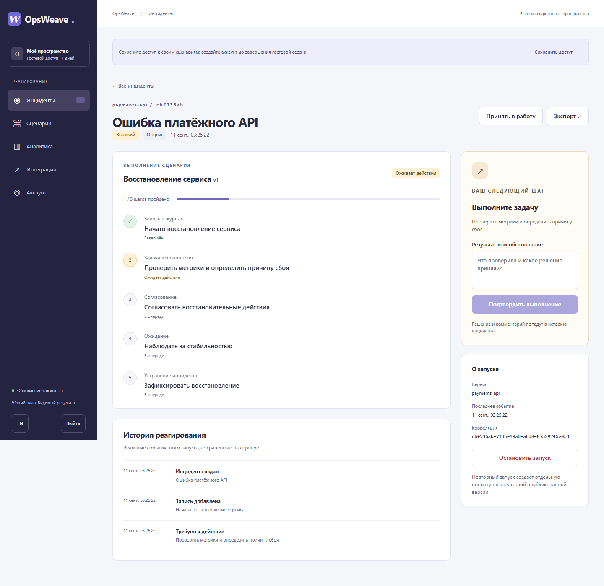
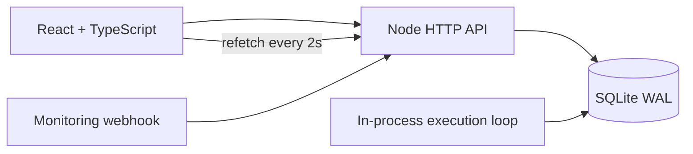

# OpsWeave

[](https://github.com/godaylor/opsweave/actions/workflows/ci.yml)

**От инцидента к понятному следующему действию.** OpsWeave позволяет создать сценарий реагирования, запустить его для инцидента, выполнить задачи, согласовать решения и получить сохранённую историю результата.

Это рабочее приложение с сервером и базой данных. Гостевой вход создаёт отдельное личное пространство, без общих демонстрационных данных. Аккаунт сохраняет доступ между устройствами. RU включён по умолчанию; EN переключается в интерфейсе.

**Public production:** hosting is not connected yet. The historical GitHub Pages address is a static predecessor and is **not** the live application. Use the local instructions below or provision the included deployment blueprint.



## Основной сценарий

1. Откройте личное пространство или зарегистрируйтесь.
2. Создайте сценарий с нуля или используйте редактируемый шаблон восстановления.
3. Сохраните и опубликуйте его. Публикация фиксирует версию.
4. Создайте инцидент: название, сервис, приоритет, сценарий.
5. Сервер выполняет шаги. Подтвердите результат задачи и согласуйте действие с комментарием.
6. Дождитесь таймера и завершения, повторно откройте результат, выгрузите JSON-историю.

## Возможности

- Редактор последовательных сценариев: запись в журнал, задача исполнителю, согласование, таймер, устранение инцидента.
- Условия по приоритету: неподходящие шаги явно отмечаются как пропущенные.
- Отдельные черновики и опубликованные версии; проверка ревизии защищает от перезаписи изменений другого окна.
- Серверное выполнение, долговечные таймеры и восстановление после перезапуска.
- История решений, корреляция событий, экспорт и отдельные повторные попытки.
- Входящий HTTP API с ключом только на создание инцидентов, сроком действия, ротацией и идемпотентностью.
- Метрики фактических инцидентов: время принятия, время устранения, приоритеты и результаты сценариев.
- Изолированные пространства, гостевой доступ с возможностью регистрации, RU/EN, адаптивный интерфейс.

Шаг «задача» требует выполнения человеком; он не притворяется автоматическим перезапуском сервиса. Исходящие Slack/email/HTTP actions, совместные организации/роли, SSO, password recovery и native DAG/fork/join не реализованы в этой компактной версии. Автообновление интерфейса использует polling, не WebSocket. Изменения редактора сохраняются явной кнопкой, не autosave.

## Architecture / stack



| Layer | Actual technology |
|---|---|
| UI | React 19, TypeScript, React Hook Form, TanStack Query, original CSS |
| Build | Vite 6, lazy editor chunk |
| Server | Node.js 22, built-in HTTP, crypto/scrypt, SQLite |
| Persistence | SQLite WAL, transactions, scoped records, immutable run snapshots |
| Execution | Ordered server loop, durable cursor and timer deadline, transactional events |
| Verification | Mocha, Playwright/Chromium, TypeScript, Biome |
| Distribution | One Node process; optional Docker image and Render blueprint |

No server npm runtime dependencies. React libraries are bundled into static assets. No Redis, MongoDB, ClickHouse, provider framework or upstream runtime is needed.

## Local development

Use Node **22.23.0** for the reproducible release target (22.15+ supports the APIs used).

```sh
npm ci --ignore-scripts
npm run build
npm start
```

Open `http://127.0.0.1:32320`. SQLite is created at `data/opsweave.sqlite`. No seed or Docker is required. If the port is busy, choose another free **32300–32399** port and set both `PORT` and `PUBLIC_ORIGIN`; never stop another project's process.

The Node 22 SQLite API prints an experimental warning. This warning is not hidden.

| Variable | Default / purpose |
|---|---|
| `PORT` | `32320` |
| `HOST` | `127.0.0.1`; use `0.0.0.0` behind a production HTTPS proxy |
| `PUBLIC_ORIGIN` | `http://127.0.0.1:32320`; exact public origin, required HTTPS in production |
| `DATABASE_PATH` | `data/opsweave.sqlite`; place on a persistent disk |
| `PUBLIC_DIR` | `dist/opsweave-public` |
| `NODE_ENV` | Set `production` for the HTTPS configuration guard |
| `OPSWEAVE_TEST_PORT` | `32330`; isolated browser test server, existing servers are refused |

Sessions are random, stored hashed, HttpOnly, SameSite=Strict and Secure on HTTPS. Passwords use scrypt. Never commit a database, backup, cookie, API key or `.env` file. Unregistered guest access expires after seven days; register before that to retain access. There is no email recovery yet.

## Checks

```sh
npm run typecheck
npm run lint
npm test
npm run build
npx playwright install chromium
npm run test:e2e
```

Tests create separate SQLite files and choose only OpsWeave test ports. They do not connect to a seeded database. Browser tests drive actual API execution, including human decisions and a timer. Screenshots are generated in `screenshots/`.

The build generates exact third-party license texts and an SPDX browser dependency inventory. Docker base-image licensing and vulnerability scanning are separate checks, not implied by the browser inventory.

## Deployment

The smallest supported deployment is **one long-running Node service with a persistent local disk and HTTPS**. Do not deploy this SQLite application to an ephemeral filesystem or several independent replicas.

The included `render.yaml` provisions a Docker web service plus a 1 GB disk. It uses a **paid plan** because persistent disks are not available on Render's free web services. No hosting subscription is created by the repository itself.

[Open the Render blueprint](https://dashboard.render.com/blueprint/new?repo=https://github.com/godaylor/opsweave). The blueprint derives `PUBLIC_ORIGIN` from Render's assigned `RENDER_EXTERNAL_URL`; no secret or manual URL is required. Connect billing/provisioning in your own account. After deployment, verify `/api/health`, then perform the full create → publish → run → approve → resolve flow at the **public URL**. A local test is not a public release check. Set `PUBLIC_ORIGIN` explicitly if you later add a custom domain.

For another server: build the included Dockerfile, mount a private writable volume at `/data`, and provide `PUBLIC_ORIGIN`. The process runs as the unprivileged `node` user. Only expose HTTP through an HTTPS reverse proxy; SQLite is not a network service.

### Backup and restore

```sh
DATABASE_PATH=/data/opsweave.sqlite node apps/api/standalone/backup.mjs /private-backups/opsweave-new.sqlite
```

This uses SQLite's consistent backup API and refuses to overwrite a file. Protect backups like credentials: they contain account and incident data. Restore to a **new** private data path and run a separate isolated service to verify the history before switching traffic. Never copy only a live WAL database file or overwrite the working production database. Keep the previous image/data available during a rollout; schema migration automation is not included.

## Provenance and contribution

OpsWeave began as an exploration on Novu Community Edition. The September 2026 standalone product replaces that runtime with original authentication, persistence, execution and interface code. This repository exports only that implementation and ordinary documented dependencies; it does not publish the old monorepo or claim authorship of Novu.

The project contribution is the product contract, incident/step state machine, transactional execution and replay, tenant boundary, UI and localization, integration API, focused verification, and deployable distribution. See [THIRD-PARTY.md](THIRD-PARTY.md). Original project code is [MIT](LICENSE).

## English

OpsWeave is a personal incident-response workspace. Build and publish a sequential playbook, start an incident, complete responder tasks and approve decisions, then review durable execution results. A compact Node/SQLite backend keeps the main workflow functional without an enterprise notification stack. This edition is a single-user workspace product, not an on-call paging service or a multi-team incident-management platform.

See [PORTFOLIO_HANDOFF.md](PORTFOLIO_HANDOFF.md) for the precise release status and portfolio material.
